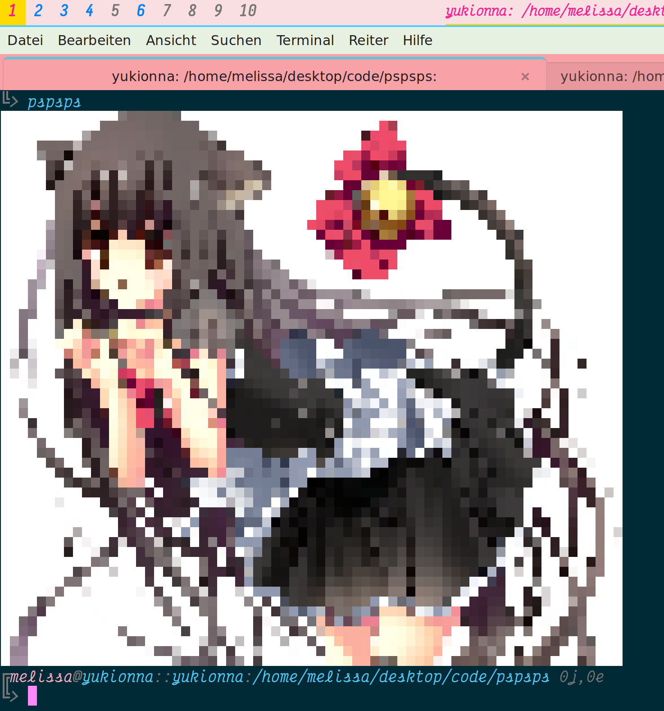
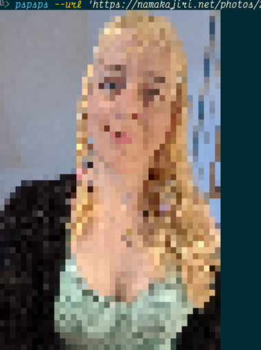

pspsps(1): call a catgirl from the Internyet to the Linux terminyal
===================================================================

----------------------------

> show processes: ps    
> show catgirls: pspsps    
>    —`@ln@chaos.social`

----------------------------

## pspsps(1) is a compyuter software to call an online catgirl nya.

pspsps(1) is nice and tries to guess the best options for you~ ฅ^•ﻌ•^ฅ    
for most ppl u can just call `pspsps` n it will work! probably (｡•̀ᴗ~)-✧

u can control colours, backnyends n stuff.    
call it with `-h`, the options should be self-explanyative.

if it looks wrong try with less colours!    

the more columns and lines u can use, the better the drawings will
look. if you want to use the whooole screen width, try `-w`! but it
can draw the catgirls taller than the terminyal n need scroll.  why
not use it with `pspsps -w|less -R` (＾ 〜)–☆

catgirls are kindly provided by Safebooru.    
u can call other peoples too with `--tags`. like

there are optinyons to make them smaller or bigger or save the images
or load from an image and meowre!    

u can also make drawings with nyascii characters nyanstead of
colourful nyansi art.  tho the mangas in nyascii dont look so good in
most terminyal sizes, mew.  but on the linux kyonsole (with few
colours & no Nyunicode but good resolution) a girl thinks ascii looks
better nyoften. so the defaults are for nyansi on graphical terminals
and nyascii on console.

## the 'installation' how to

    pip3 install pspsps

## ✨🍭 search help 🍬💖

    pspsps -t femboy_hooters
show femboys from femboy hooters `(人*´∀｀)｡*ﾟ+`

    pspsps -t 'catgirl bunnygirl'
show catgirls together with bunnygirls

    pspsps -t catgirl,bunnygirl
show catgirls together with bunnygirls but easier to type

    pspsps -t 'catgirl kiss -hetero'
asks for catgirls kissing but no hetero >:(    
but sometimes hetero comes anyway (u.u )

## things a girl still wants to-do nya

 - optinyon to show the URL of the nyoriginal post, nyot just the image URL!
   - a history file is the perfect place to add the post data, also save the file URLs.
   - a `--last` option would be fun, run different options on the last image you've seen (better if it can check the `--saved` path)

 - support danbooru! it is a bit scary tho (^ ^);
   - danbooru API is prob useful to unify tag synonymyms!

 - tests, who is a girl kidding, nyobody does tests ever

## authoress

it’s me, mewlissa nya    
melissa@namakajiri.net

minnabody let’s keep up the 'LINUX'! with spirit of gentleness and love no kokoro

*uw ûw úwu ŭ úwuwu*    
you all gay and cute.and.valid

*ũw ówüw ûvowo ũvòv òwo ùwu ùwu öv ŏvo ŏvo*    
thing difficult system that person few few own many many

*òwo-úwu õvò ówuv ûwuwu ù uw-üwu nyáa*    
ppl-cuties IMP do kind to your-selves please

*ŭ üv õvò üwo uvuwu ûvü!*    
and take IMP mass means labour!
