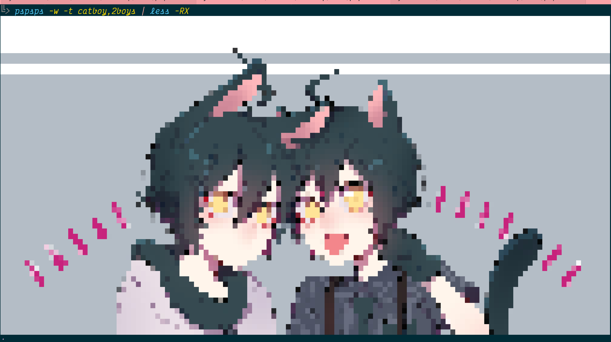

pspsps(1): call a catgirl from the Internyet to the Linux terminyal
===================================================================

> show processes: ps    
> show catgirls: pspsps    
—@ln@chaos.social

pspsps(1) is a mewscript to call an online catgirl nya.

pspsps is nice and tries to guess the best options for you~ ฅ^•ﻌ•^ฅ
for most ppl u can just call `pspsps` n it will work! I hope (｡•̀ᴗ~)-✧

u can control colours backnyends n stuff.
call it with -h, the options should be self-explanyative.

if it looks wrong try with less colours!
the more columns and lines in your terminyal, the better the drawings
will look.

catgirls are kindly provided by Safebooru.
u can call other peoples too with `--tags`. like

there are optinyons to make them smaller or bigger or save the images
or load from an image and much meowre!    

u can also make drawings with nyascii kyaracters nyanstead of colourful nyansi
art. tho nyascii doesnt look so good in most terminyal sizes, mew.

## the 'installation' how to

    pip3 install pspsps

## ✨🍭 search help 🍬💖

    pspsps -t femboy_hooters
show femboys from femboy hooters (人*´∀｀)｡*ﾟ+

    pspsps -t 'catgirl bunnygirl'
show catgirls together with bunnygirls

    pspsps -t catgirl,bunnygirl
show catgirls together with bunnygirls but easier to type

    pspsps -t 'catgirl kiss -hetero'
asks for catgirls kissing but no hetero >:(    
but sometimes hetero comes anyway (u.u )

# authoress

it’s me, mewlissa nya

minnabody lets keep up the 'LINUX'! with spirit of kindness and love no kokoro
